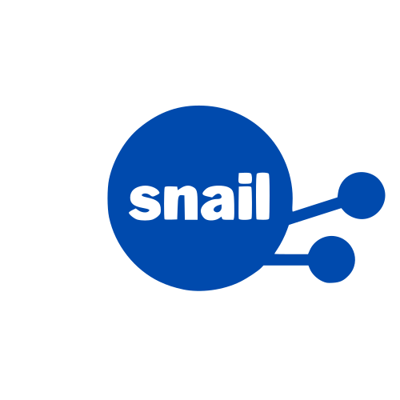

==========================================
spatial networks impact assessment library
==========================================

.. raw:: html

   

.. raw:: html

   

snail is a Python package to help with analysis of the potential impacts of
climate hazards on infrastructure networks.

.. image:: https://img.shields.io/badge/github-snail-brightgreen.svg
   :target: https://github.com/nismod/snail/
   :alt: snail on github

.. image:: https://img.shields.io/pypi/l/nismod-snail.svg
    :target: https://opensource.org/licenses/MIT
    :alt: License

.. image:: https://github.com/nismod/snail/actions/workflows/build.yml/badge.svg
    :target: https://github.com/nismod/snail/actions/workflows/build.yml
    :alt: Build

.. image:: https://img.shields.io/pypi/v/nismod-snail.svg
    :target: https://pypi.org/project/nismod-snail/
    :alt: PyPI version

.. mdinclude:: ../../README.md
   :start-line: 22
   :end-line: 95

.. toctree::
   :maxdepth: 2
   :caption: Contents:

Contents
--------

.. toctree::
   :maxdepth: 2

   Getting Started <getting_started>

.. toctree::
   :maxdepth: 3

   Reference <api/modules>

.. toctree::
   :maxdepth: 1

   License <license>

Indices and tables
------------------

* :ref:`genindex`
* :ref:`modindex`
* :ref:`search`
